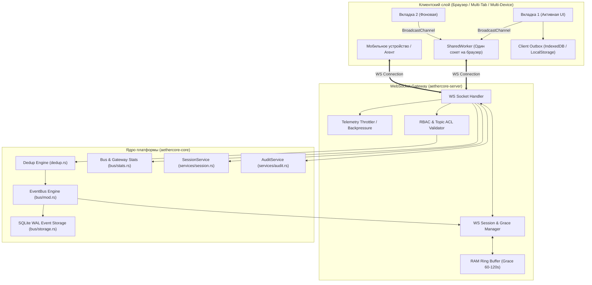
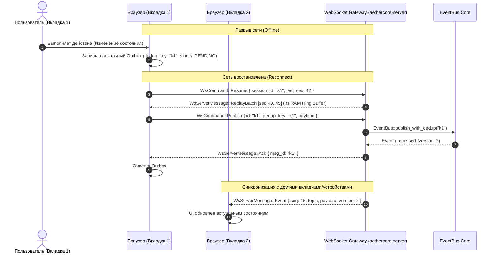

# Архитектурная спецификация расширения WebSocket-шлюза (`ws`) (Предложение 2)

> **Модуль:** `crates/aethercore-server/src/ws/mod.rs`, `crates/aethercore-core/src/bus/`  
> **Статус:** полная объединённая спецификация  
> **Связанный документ:** [`WsModuleProposals(предложение 1).md`](file:///opt/aethercore/WsModuleProposals%28%D0%BF%D1%80%D0%B5%D0%B4%D0%BB%D0%BE%D0%B6%D0%B5%D0%BD%D0%B8%D0%B5%201%29.md)

---

## 1. Контекст и архитектурный обзор

Шлюз WebSocket платформы AetherCore (`/ws/events`) переводится из режима простого широковещательного транслятора в полноценный, отказоустойчивый, двунаправленный транспорт реального времени с гарантией целостности данных при нестабильной сети и поддержкой одновременной работы множества вкладок/устройств одного пользователя.



---

## 2. Архитектура надежной доставки и мульти-клиента

### 1. Архитектура надежной доставки при нестабильной сети (Offline-First & Resync)

#### А. Монотонная нумерация (`Sequence ID`) и курсоры потока
Каждому сообщению в рамках соединения или глобального топика присваивается монотонный порядковый номер (`seq: u64`).  
Клиент хранит `last_received_seq` и периодически отправляет подтверждение доставки:
```json
{ "action": "ack", "seq": 1542 }
```

#### Б. Возобновление сессии (Session Resume & Reconnect Window)
* **Сессионный кольцевой буфер в памяти сервера (RAM Ring Buffer)**:
  * При обрыве соединения сервер не уничтожает подписку мгновенно, а переводит её в состояние ожидания (Grace Period, например, 60–120 секунд).
  * Все входящие события продолжают накапливаться в кольцевом буфере сессии.
* **Быстрый реконнект без потери сообщений**:
  * При восстановлении связи клиент отправляет:
    ```json
    { "action": "resume", "session_id": "ws-sess-xyz", "last_seq": 1540 }
    ```
  * Сервер мгновенно «достреливает» пропущенные сообщения (`seq: 1541..=current`) прямо из оперативной памяти без обращения к диску.
* **Холодный ресинк (Cold Fallback)**:
  * Если таймаут ожидания истек или буфер переполнился, сервер возвращает сигнал `SYNC_REQUIRED`, после чего клиент запрашивает актуальный срез из [персистентного хранилища `storage.rs`](file:///opt/aethercore/crates/aethercore-core/src/bus/storage.rs) и Retained-состояний.

#### В. Клиентский Outbox-буфер (надежная публикация)
* Команды и события, отправляемые из браузера/клиента, сохраняются в локальный буфер (IndexedDB / очередь в памяти).
* При падении сети сообщения накапливаются. При реконнекте очередь автоматически отправляется с подтверждением от сервера:
```json
{ "type": "ack", "msg_id": "c1f8a84b-..." }
```

---

### 2. Мульти-вкладки в одном браузере и мульти-устройства

#### А. Иерархия идентификации: `User` $\rightarrow$ `Device` $\rightarrow$ `Tab/Session`
* **`user_id`**: Владелец учетной записи.
* **`device_id` / `machine_id`**: Уникальный отпечаток устройства (сохраняется в `localStorage` браузера или конфиге машины).
* **`tab_id` / `session_id`**: Идентификатор конкретной вкладки (в `sessionStorage`).
* **Результат**: Сервер точно знает, какие устройства и сколько вкладок у пользователя активны прямо сейчас.

#### Б. Синхронизация состояния между вкладками и машинами (Cross-Tab / Cross-Device Sync)
* **Эхо-оповещения (Loopback / Multi-device Broadcast)**:
  * Когда пользователь выполняет действие на Вкладке №1 (или на Устройстве А), событие об изменении через шину мгновенно доставляется на Вкладку №2 и Устройство Б.
  * Интерфейс на всех экранах обновляется синхронно без перезагрузки страниц.
* **Идемпотентность и защита от дублирования (`dedup_key`)**:
  * Если нестабильная сеть привела к повторной отправке команды с одной из вкладок при реконнекте, сервер использует встроенный механизм [дедупликации `dedup.rs`](file:///opt/aethercore/crates/aethercore-core/src/bus/dedup.rs). Команда гарантированно выполнится ровно **один раз** (Exactly-Once processing).

#### В. Оптимистичные блокировки и версионирование (Conflict Prevention)
* Каждое состояние сущности имеет монотонную версию (`version` или `updated_at`).
* Если на Устройстве А и Устройстве Б одновременно открыта форма редактирования, попытка сохранить устаревшую версию вернет ошибку конфликта (`409 CONFLICT` / `STATE_OUTDATED`) с предложением обновить данные.

#### Г. Оптимизация сетевых соединений в браузере (SharedWorker / BroadcastChannel)
Для браузера с 10+ открытыми вкладками одного приложения:
* **Фронтенд-оптимизация**: Использование `SharedWorker` — открывается **ровно одно** WebSocket-соединение к серверу на весь браузер, а между вкладками данные раздаются через `BroadcastChannel`.
* **Бэкенд-поддержка**: Сервер поддерживает мультиплексирование потоков для нескольких `tab_id` внутри одного TCP/WS канала.

---

## 3. Схема взаимодействия при обрыве сети и реконнекте



---

## 4. Подробное описание остальных функциональных блоков

### 1. Двунаправленный обмен и публикация (Publish & RPC over WS)
* **Публикация событий клиентами (`Publish`)**:
  * Возможность для UI, мобильных клиентов и внешних агентов публиковать сообщения в шину через WebSocket:
    ```json
    { "action": "publish", "topic": "devices.switch1.command", "payload": { "power": "on" }, "retain": false, "priority": "Normal", "dedup_key": "cmd-42" }
    ```
  * Валидация прав пользователя ([`RBAC`](file:///opt/aethercore/crates/aethercore-core/src/auth/mod.rs)) на публикацию в конкретные топики.
* **WebSocket RPC (Request-Reply)**:
  * Поддержка асинхронных запросов-ответов по WebSocket с сопоставлением по `correlation_id` / `request_id`.
  * Позволяет выполнять команды (перезапуск модуля, управление устройствами, вызов API плагинов) через единое открытое WS-соединение без постоянных HTTP POST запросов.

---

### 2. Безопасность и управление жизненным циклом сессий (Auth & Sessions)
* **In-Band аутентификация (`Authenticate` / `Refresh`)**:
  * Аутентификация через первое служебное сообщение `{ "action": "auth", "token": "..." }` вместо передачи JWT в URL-параметре `?token=...` (предотвращает утечку токенов в access-логи прокси/Nginx/браузеров).
  * Ротация/продление токена без разрыва установленного WebSocket-соединения.
  * Обязательная проверка токена (`allow_anonymous: false` по умолчанию).
* **Интеграция с [`SessionService`](file:///opt/aethercore/crates/aethercore-core/src/services/session.rs)**:
  * Регистрация активного WS-клиента в реестре сессий (с привязкой к `user_id`, `client_ip`, `user_agent`, `device_id`, `tab_id`).
  * Принудительное закрытие WebSocket-сессии с кодом `4001 Unauthorized` при отзыве сессии администратором или смене пароля.
* **Topic ACL и валидация Origin**:
  * Whitelist/blacklist топиков на уровне пользователя/роли.
  * Валидация заголовка `Origin` для защиты браузерных клиентов от атак CSWSH.

---

### 3. Продвинутая фильтрация, Throttling и Backpressure
* **Фильтрация на стороне подписки**:
  * Фильтрация не только по топику, но и по минимальному приоритету (`min_priority: "High"`), типу события ([`EventType::Reliable`](file:///opt/aethercore/crates/aethercore-common/src/models/events.rs) vs `Telemetry`) или источнику (`source`).
* **Защита от медленных клиентов (Slow Consumer & Backpressure Protection)**:
  * Bounded-буфер сокетов: реализация кольцевого буфера / drop-политики для некритичной телеметрии (`EventType::Telemetry`) при переполнении исходящей очереди сокета с логированием предупреждения.
* **Троттлинг / Rate Limiting телеметрии**:
  * Опциональное ограничение частоты отправки кадров (downsampling) для UI (например, отдавать не чаще 10–20 кадров/сек по высокочастотным датчикам).

---

### 4. Восстановление состояния и дочитка истории (Replay & Catch-up)
* **История при переподключении (`Replay` / `Sync`)**:
  * Возможность передать `last_sequence_id` или `since_timestamp` для автоматической дочитки пропущенных персистентных событий из [персистентного хранилища `storage.rs`](file:///opt/aethercore/crates/aethercore-core/src/bus/storage.rs).
* **Синхронизация пачек Retained-состояний**:
  * Возможность массового запроса актуальных состояний (`GetState { patterns: [...] }`) в виде одного пакетного ответа.

---

### 5. Метрики, диагностика и Heartbeat
* **Серверный Heartbeat / Ping-Pong тайм-аут**:
  * Периодическая посылка WebSocket-кадров Ping со стороны сервера с автоматическим отключением "зависших" (half-open / ghost) клиентов через timeout (например, 30 секунд).
* **Фикс утечки фоновых задач**:
  * Гарантированный `.abort()` второй tokio-задачи при завершении первой в `tokio::select!` обработчика сокета.
* **Реестр подключений и телеметрия шлюза**:
  * Мониторинг: количество активных сокетов, ingress/egress байт/сек, количество доставленных/сброшенных сообщений.
  * Интеграция со статистикой шины [статистики шины `stats.rs`](file:///opt/aethercore/crates/aethercore-core/src/bus/stats.rs) и эндпоинт `GET /api/v1/ws/connections`.
* **Административные команды и аудит**:
  * `kick {conn_id}` (принудительный сброс сокета), broadcast `announce` (оповещение о техработах). Запись connect/disconnect в журнал [`AuditService`](file:///opt/aethercore/crates/aethercore-core/src/services/audit.rs).

---

### 6. Протокол и типизация (Binary / Protocol Envelopes)
* **Стандартизированные ответы об ошибках (`WsServerMessage::Error`)**:
  * Четкая структура ошибок: `{ "type": "error", "code": "FORBIDDEN", "message": "...", "request_id": "..." }`.
* **Поддержка субпротоколов и MessagePack / CBOR**:
  * Договор субпротокола через заголовок `Sec-WebSocket-Protocol` (`aethercore.json`, `aethercore.msgpack`) для более компактной передачи тяжелой бинарной телеметрии.

---

## 5. Спецификация контрактов протокола (Rust / Serde)

### Входящие команды клиента (`WsClientCommand`)

```rust
#[derive(Debug, Deserialize)]
#[serde(tag = "action", rename_all = "snake_case")]
pub enum WsClientCommand {
    /// In-Band авторизация / ротация токена
    Auth {
        token: String,
        device_id: Option<String>,
        tab_id: Option<String>,
    },
    /// Возобновление сессии после разрыва связи (Grace Period Resume)
    Resume {
        session_id: String,
        last_seq: u64,
    },
    /// Подтверждение приема событий клиентом (ACK)
    Ack {
        seq: u64,
    },
    /// Публикация события / команды в шину ядра
    Publish {
        id: Option<Uuid>,
        topic: String,
        payload: serde_json::Value,
        #[serde(default)]
        priority: EventPriority,
        #[serde(default)]
        retain: bool,
        dedup_key: Option<String>,
    },
    /// Двунаправленный Request-Reply RPC запрос
    Request {
        request_id: String,
        topic: String,
        payload: serde_json::Value,
        timeout_ms: Option<u64>,
    },
    /// Массовый запрос сохраненных Retained-состояний
    GetState {
        patterns: Vec<String>,
        #[serde(default = "default_retained_limit")]
        limit_per_topic: usize,
    },
    /// Управление подписками
    Subscribe {
        topics: Vec<String>,
        #[serde(default)]
        with_retained: bool,
    },
    Unsubscribe {
        topics: Vec<String>,
    },
    /// Установка фильтров потока
    SetFilter {
        min_priority: Option<EventPriority>,
        event_types: Option<Vec<EventType>>,
        source: Option<String>,
    },
    /// Heartbeat пинг
    Ping,
}

fn default_retained_limit() -> usize { 20 }
```

### Исходящие сообщения сервера (`WsServerMessage`)

```rust
#[derive(Debug, Serialize)]
#[serde(tag = "type", rename_all = "snake_case")]
pub enum WsServerMessage {
    /// Успешная аутентификация и выдача параметров сессии
    Authenticated {
        session_id: String,
        user_id: Uuid,
        username: String,
        heartbeat_interval_secs: u64,
    },
    /// Событие шины с монотонным sequence-номером
    Event {
        seq: u64,
        event: EventMessage,
    },
    /// Пакет пропущенных событий при быстром реконнекте (из RAM Ring Buffer)
    ReplayBatch {
        from_seq: u64,
        to_seq: u64,
        events: Vec<EventMessage>,
    },
    /// Сигнал о необходимости холодного ресинка (сессия истекла / буфер переполнен)
    SyncRequired {
        reason: String,
        suggested_since_seq: u64,
    },
    /// Пакетный ответ на запрос сохраненных состояний (GetState)
    StateSnapshot {
        events: Vec<EventMessage>,
    },
    /// Подтверждение публикации для очистки клиентского Outbox
    Ack {
        msg_id: Uuid,
        status: String,
    },
    /// Ответ на двунаправленный RPC-запрос
    Response {
        request_id: String,
        result: serde_json::Value,
    },
    /// Системные уведомления и подтверждения
    Subscribed { topics: Vec<String> },
    Unsubscribed { topics: Vec<String> },
    Announce { message: String, level: String },
    Pong,
    Error {
        code: String,
        message: String,
        request_id: Option<String>,
    },
}
```

---

## 6. Сводная таблица ценности и сложности

| # | Функция / Требование | Раздел | Ценность | Сложность |
|---|----------------------|--------|----------|-----------|
| **1** | Обязательная авторизация + In-Band `auth` | Безопасность | 🔴 Критично | Низкая |
| **2** | Серверный Heartbeat + фикс утечки tokio-задач | Надёжность | 🔴 Критично | Низкая |
| **3** | Sequence ID (`seq`) + RAM Ring Grace Period (60–120с) | Сеть / Resync | 🔴 Критично | Средняя |
| **4** | Публикация событий (`publish`) + `dedup_key` | Интерактивность | 🔴 Критично | Низкая–средняя |
| **5** | Client Outbox & Delivery ACK | Сеть / Клиент | Высокая | Средняя |
| **6** | Иерархия `User/Device/Tab` + Кросс-вкладочный эхо-синк | Мульти-клиент | Высокая | Средняя |
| **7** | Интеграция с `SessionService` (отзыв сессий, 4001 code) | Безопасность | Высокая | Низкая |
| **8** | Холодный ресинк (`Cold Sync`) из `bus/storage.rs` | Сеть / Resync | Высокая | Средняя |
| **9** | Массовый запрос состояний `GetState` | Синхронизация | Высокая | Низкая |
| **10** | Request-Reply RPC поверх WS (`request` / `response`) | Интерактивность | Средняя | Средняя |
| **11** | Фильтры потока (приоритет, тип, source) + Downsampling | Производительность | Средняя | Низкая |
| **12** | Backpressure-политика (Slow Consumer Drop) | Производительность | Высокая | Средняя |
| **13** | Реестр сокетов (`/api/v1/ws/connections`) + метрики | Наблюдаемость | Средняя | Низкая |
| **14** | Админские команды (`kick`, `announce`) + аудит | Администрирование | Средняя | Низкая |
| **15** | Frontend SDK (SharedWorker + BroadcastChannel) | Инфраструктура | Высокая | Средняя |
| **16** | E2E Интеграционные тесты на Axum/Tokio | Инфраструктура | Высокая | Средняя |

---

## 7. Дорожная карта реализации

### Приоритет 1 — Безопасность, стабильность и базовый транспорт (Немедленно)
- [ ] 1. Обязательная проверка авторизации + In-Band auth (`action: "auth"`).
- [ ] 2. Серверный Heartbeat + закрытие ghost-сокетов по таймауту (30с).
- [ ] 3. Фикс утечки tokio-задач (`.abort()` при выходе из `tokio::select!`).
- [ ] 4. Команда `publish` с валидацией прав RBAC и поддержкой `dedup_key`.
- [ ] 5. Интеграция с [`SessionService`](file:///opt/aethercore/crates/aethercore-core/src/services/session.rs) (отзыв сессий, код 4001).

### Приоритет 2 — Устойчивость к сети и мульти-клиент (Основной релиз)
- [ ] 6. Sequence ID (`seq`) в событиях + сессионный Grace Period (RAM Ring Buffer).
- [ ] 7. Команды `resume` (быстрая дочитка `ReplayBatch`) и `ack`.
- [ ] 8. Команда пакетного запроса состояний `GetState`.
- [ ] 9. Иерархия `device_id` / `tab_id` и кросс-вкладочная трансляция событий.
- [ ] 10. Стандартизированный `WsServerMessage::Error`.

### Приоритет 3 — RPC, производительность и масштабирование (Расширение)
- [ ] 11. Двунаправленный Request-Reply RPC поверх WS.
- [ ] 12. Backpressure-политика (сброс некритичной телеметрии для лагающих сокетов).
- [ ] 13. Фильтры потока (`SetFilter`) и троттлинг телеметрии.
- [ ] 14. Реестр активных соединений (`GET /api/v1/ws/connections`) и экспорт метрик в [`bus/stats.rs`](file:///opt/aethercore/crates/aethercore-core/src/bus/stats.rs).
- [ ] 15. TypeScript SDK с поддержкой `SharedWorker` + `BroadcastChannel` и Outbox.
- [ ] 16. E2E интеграционные тесты шлюза.
