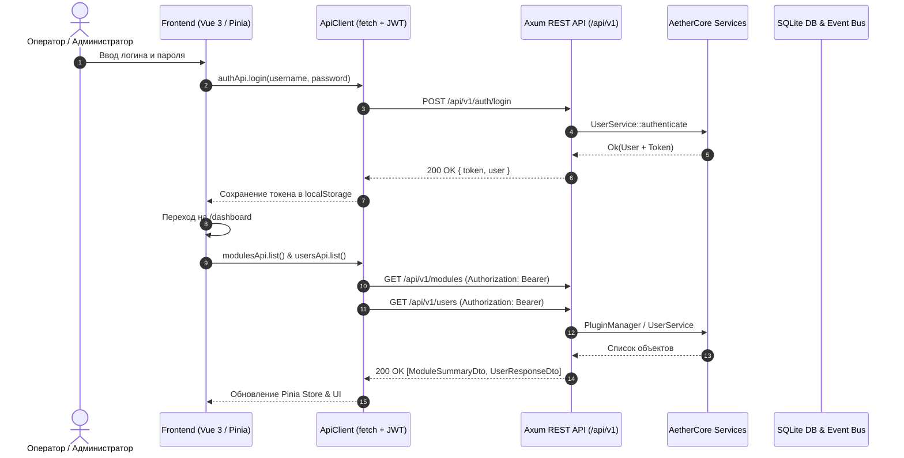

# Архитектура интеграции Frontend с REST API AetherCore

## Диаграмма взаимодействия (Mermaid)

## Тест-кейсы для верификации

### ТК-1: Сквозная аутентификация и инициализация сессии
* **Given**: Пользователь находится на странице `/login`, токен в `localStorage` отсутствует.
* **When**: Пользователь вводит валидные `username` и `password` и нажимает "Войти".
* **Then**: Отправляется запрос `POST /api/v1/auth/login`. При ответе `200 OK` JWT-токен сохраняется в `localStorage`, обновляется `authStore.user`, и происходит редирект на `/dashboard`.

### ТК-2: Обработка истечения токена (401 Unauthorized)
* **Given**: Пользователь выполняет запрос с устаревшим или невалидным JWT-токеном.
* **When**: Бэкенд возвращает статус `401 Unauthorized`.
* **Then**: `ApiClient` сбрасывает сохраненный токен, и маршрутизатор перенаправляет пользователя на `/login`.
