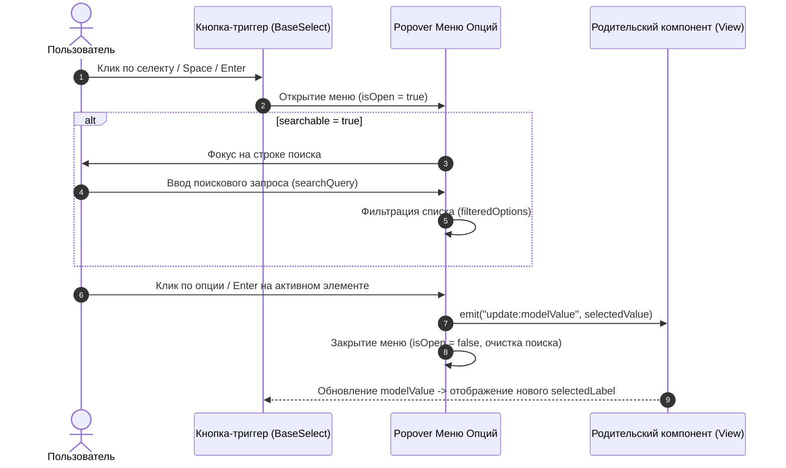

# Архитектура: BaseSelect.vue (Унифицированный компонент Select)

## Описание
`BaseSelect.vue` — единый UI-компонент выпадающего списка дизайн-системы AetherCore. Он заменяет все нативные браузерные теги `<select>` на стилизованные кастомные дропдауны с темной палитрой, поддержкой поиска (`searchable`), иконок опций, клавиатурной навигацией и анимацией шеврона.

---

## Взаимодействие и жизненный цикл (Mermaid)

---

## Тест-кейсы для верификации

### ТК-SEL-1: Базовый выбор значения из списка (без поиска)
* **Given**: Компонент `BaseSelect` с набором опций `[ { label: 'Русский', value: 'ru' }, { label: 'English', value: 'en' } ]` и текущим значением `ru`. Меню закрыто.
* **When**: Пользователь кликает по триггеру селекта.
* **Then**: Меню открывается, шеврон `expand_more` плавно поворачивается на 180°, текущий активный пункт `Русский` подсвечен и отмечен галочкой `check`.
* **When**: Пользователь кликает по пункту `English`.
* **Then**: Срабатывает событие `update:modelValue` со значением `'en'`, меню закрывается, в кнопке-триггере отображается `English`.

### ТК-SEL-2: Фильтрация опций в режиме `searchable = true`
* **Given**: Компонент `BaseSelect` для выбора часового пояса с `searchable = true` и сотнями опций.
* **When**: Пользователь открывает выпадающий список.
* **Then**: Меню открывается, фокус автоматически переносится в поле поиска.
* **When**: Пользователь вводит "Moscow".
* **Then**: В списке отфильтровываются только подходящие зоны (Europe/Moscow, UTC+3), остальные скрываются. При клике на "Europe/Moscow" значение выбирается, а поле поиска очищается.

### ТК-SEL-3: Закрытие дропдауна по клику вне элемента и клавише Escape
* **Given**: Выпадающий список открыт (`isOpen = true`).
* **When**: Пользователь нажимает клавишу `Escape` или кликает в любую свободную область страницы вне `BaseSelect`.
* **Then**: Меню закрывается (`isOpen = false`), поиск сбрасывается, значение `modelValue` остается неизменным.

### ТК-SEL-4: Поддержка иконок и кастомных слотов опций
* **Given**: Передан список `options` с полями `icon` (например, для категорий аудита: `auth` -> `key`, `role` -> `badge`).
* **When**: Меню открыто.
* **Then**: Каждая опция отображает свою иконку Material Symbols рядом с текстом, выбранный элемент имеет акцентную подсветку `primary-fixed-dim`.

### ТК-SEL-5: Кастомный триггер через слот `#trigger`
* **Given**: Компонент `BaseSelect` с передачей шаблона `<template #trigger="{ toggle, selectedOption }">` (компактная кнопка-иконка тулбара с `placement="right"`).
* **When**: Пользователь кликает по кнопке-иконке.
* **Then**: Вызывается `toggle()`, открывается стилизованный поповер со списком опций, выровненный по правому краю (`right-0`). При выборе опции меню закрывается, срабатывает `update:modelValue`.

