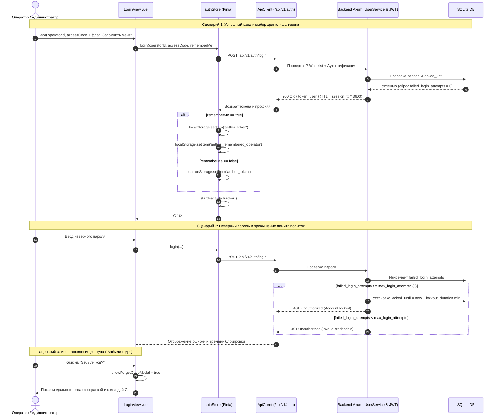
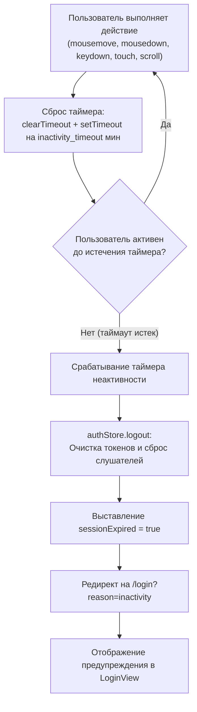
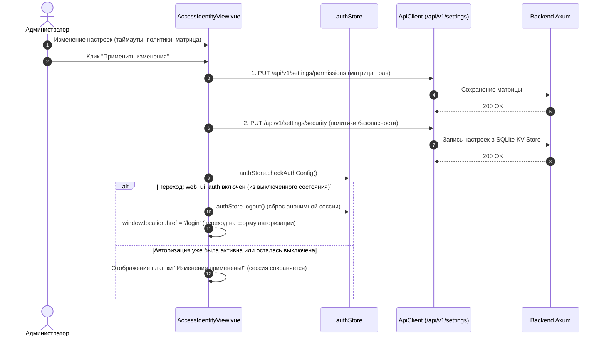

# Архитектура и блок-схемы работы Frontend (Vue 3 + Pinia + Vite)

Данный документ описывает ключевые сценарии функционирования фронтенд-приложения AetherCore Platform Next-Gen: жизненный цикл приложения, навигационные проверки роутера, процедуру входа (включая «Запомнить меня», «Забыли код?», Rate Limiting & Lockout), таймер неактивности, первичную настройку со сложностью паролей и управление операторами.

---

## 1. Блок-схема: Жизненный цикл, проверка токена и Router Guard

```mermaid
graph TD
    Start([Пользователь открывает страницу]) --> InitStore[Инициализация Pinia authStore]
    InitStore --> CheckStorage[Проверка токена: localStorage || sessionStorage]
    CheckStorage --> FetchCfg[GET /api/v1/auth/config<br/>Загрузка политик безопасности]
    FetchCfg --> CheckWebAuth{Политика<br/>web_ui_auth активна?}

    %% Режим без авторизации
    CheckWebAuth -- Нет (false) --> AnonMode[Режим Anonymous Admin<br/>Виртуальный суперпользователь]
    AnonMode --> CheckTargetAnon{Целевой маршрут?}
    CheckTargetAnon -- /login --> RedirDashAnon[Редирект на /dashboard]
    CheckTargetAnon -- Другой маршрут --> AllowAnon[Разрешить переход]

    %% Режим с авторизацией
    CheckWebAuth -- Да (true) --> HasToken{Токен обнаружен?}
    HasToken -- Да --> ValidateMe[GET /api/v1/auth/me]
    ValidateMe --> CheckMeResult{Токен валиден и IP разрешен?}
    CheckMeResult -- Да (200 OK) --> StartTimer[Запуск startInactivityTracker<br/>Слушатели: mouse, key, scroll]
    StartTimer --> CheckTargetAuth{Маршрут /login?}
    CheckTargetAuth -- Да --> RedirDashAuth[Редирект на /dashboard]
    CheckTargetAuth -- Нет --> AllowRoute[Разрешить переход на страницу]
    CheckMeResult -- Нет (401 / 403) --> DropToken[Очистка токенов authStore.logout]
    DropToken --> RedirLogin[Редирект на /login]
    HasToken -- Нет --> IsPublicRoute{Маршрут публичный?}
    IsPublicRoute -- Да (/login) --> ShowLogin[Отобразить форму входа]
    IsPublicRoute -- Нет --> RedirLogin

    %% Глобальный перехват ошибок API
    ApiReq([API запрос ApiClient]) --> OnApiError{Статус ответа?}
    OnApiError -- 401 Unauthorized --> DropToken
    OnApiError -- 403 Forbidden (IP) --> ShowIpError[Баннера запрета доступа по IP]
    OnApiError -- 200 OK --> ResetTimer[Сброс таймера активности]
```

---

## 2. Диаграмма последовательности: Авторизация, «Запомнить меня», Блокировка (Rate Limit) и Восстановление



---

## 3. Блок-схема: Контроль неактивности пользователя (Inactivity Timeout)



---

## 4. Блок-схема и Sequence-диаграмма: Пошаговый мастер первичной настройки (Onboarding Wizard)

### А. Блок-схема состояний мастера первого входа

```mermaid
graph TD
    LoginSuccess([Успешный вход POST /api/v1/auth/login]) --> CheckRoot{Пользователь root?}
    
    %% Аккаунт root минует мастер
    CheckRoot -- Да (username == 'root') --> DashDirect[Прямой переход на /dashboard]
    
    %% Обычный пользователь
    CheckRoot -- Нет --> CheckFirstLogin{Первый вход (!last_login_at)<br/>или must_change_password?}
    CheckFirstLogin -- Нет --> DashDirect
    
    %% Запуск мастера
    CheckFirstLogin -- Да --> CheckCanChangeUname{Разрешена смена логина?<br/>(login_count <= 1)}
    
    %% Шаг 1: Логин
    CheckCanChangeUname -- Да --> Step1[Шаг 1: Выбор постоянного логина]
    Step1 --> UserStep1Action{Действие пользователя}
    UserStep1Action -- "Оставить текущий" --> SetCurrentUname[Сохранить текущий username] --> Step2[Шаг 2: Новый постоянный пароль]
    UserStep1Action -- "Ввод логина + Далее" --> ValidateUname{Валидация логина<br/>(3-32 симв., [a-z0-9._-])}
    ValidateUname -- Невалиден --> ShowUnameErr[Ошибка формата логина] --> Step1
    ValidateUname -- Валиден --> Step2
    
    %% Шаг 2: Пароль (если смена логина недоступна, сразу сюда)
    CheckCanChangeUname -- Нет --> Step2
    Step2 --> UserStep2Action{Действие пользователя}
    UserStep2Action -- "Клик Назад" --> Step1
    UserStep2Action -- "Ввод пароля + Сохранить и войти" --> ValidatePwd{Пароль указан или обязателен?}
    
    ValidatePwd -- Обязателен или заполнен --> CheckComplexity{Чек-лист сложности:<br/>Длина, Заглавные, Цифры, Спецсимволы + Совпадение}
    CheckComplexity -- Ошибка --> ShowPwdErr[Отображение ошибок в форме] --> Step2
    CheckComplexity -- Успех --> SendUpdate[PUT /api/v1/users/:id<br/>{ username?, password?, must_change_password: false }]
    
    ValidatePwd -- Не обязателен и пуст --> SendUpdate
    
    SendUpdate --> UpdateResult{Ответ API}
    UpdateResult -- Ошибка (409/422) --> ShowApiErr[Вывод ошибки в модальном окне] --> Step2
    UpdateResult -- 200 OK --> SetUser[authStore.user = updated] --> CloseModal[Закрытие мастера] --> GoDash[Редирект на /dashboard]
```

### Б. Sequence-диаграмма взаимодействия UI, Store и Core

```mermaid
sequenceDiagram
    autonumber
    actor User as Пользователь
    participant UI as LoginView.vue (Wizard)
    participant Store as authStore
    participant API as ApiClient (/api/v1/users)
    participant Core as Backend UserService

    Note over User, Core: Вход пользователя (не root) при первом входе (!last_login_at || must_change_password)
    UI->>UI: Открытие модального окна мастера (wizardStep = 'username')
    
    %% Шаг 1: Логин
    rect rgb(30, 41, 59)
        Note over User, UI: Шаг 1: Персонализация логина
        User->>UI: Ввод нового постоянного логина (или клик "Оставить текущий")
        User->>UI: Клик "Далее" (wizardNext)
        UI->>UI: Локальная валидация (длина 3-32, regex a-z0-9._-)
        UI->>UI: Переключение на wizardStep = 'password'
    end

    %% Шаг 2: Пароль
    rect rgb(30, 41, 59)
        Note over User, UI: Шаг 2: Установка постоянного пароля
        alt Пользователь хочет скорректировать логин
            User->>UI: Клик "Назад" (wizardBack)
            UI->>UI: Возврат на wizardStep = 'username'
            User->>UI: Корректировка логина и повторный клик "Далее"
        end

        User->>UI: Ввод нового пароля и подтверждения
        loop Динамическая проверка сложности
            UI->>UI: Проверка passwordRequirements
            UI->>User: Интерактивная подсветка чек-листа политики безопасности
        end
    end

    %% Финальное атомарное сохранение
    Note over User, Core: Финальное сохранение на последнем шаге
    User->>UI: Клик "Сохранить и войти" (Единая финальная кнопка)
    UI->>API: PUT /api/v1/users/:id { username: "new_login", password: "NewPassword123!", must_change_password: false }
    API->>Core: update_user (валидация логина + сложность пароля + Argon2id hash)
    
    alt Ошибка валидации или конфликт логина (409/422)
        Core-->>API: 409 Conflict / 422 Unprocessable Entity
        API-->>UI: Отображение сообщения об ошибке
    else Успешное сохранение
        Core->>Core: UPDATE users SET username = ..., password_hash = ..., must_change_password = 0
        Core-->>API: 200 OK (UserResponseDto)
        API-->>Store: authStore.user = updated
        API-->>UI: 200 OK
        UI->>UI: Закрытие модального окна
        UI->>UI: router.push('/dashboard')
    end
```



---

## 5. Тест-кейсы для верификации Frontend изменений

### ТК-1: Запоминание оператора и разделение хранилищ токена
* **Given**: Пользователь открывает экран логина `/login`.
* **When**: Пользователь вводит логин `operator1`, отмечает «Запомнить меня» и успешно входит в систему.
* **Then**: Токен записан в `localStorage.getItem('aether_token')`, логин сохранен в `localStorage.getItem('aether_remembered_operator')`. При следующем открытии страницы логин подставляется автоматически.
* **When 2**: Пользователь выходит и входит без галочки «Запомнить меня».
* **Then 2**: Токен записан только в `sessionStorage.getItem('aether_token')`, в `localStorage` токен отсутствует.

### ТК-2: Автоматический выход по таймауту неактивности
* **Given**: Пользователь авторизован, в политиках безопасности установлен `inactivity_timeout = 15`.
* **When**: Пользователь не совершает действий (мышь, клавиатура, скролл) в течение 15 минут.
* **Then**: `authStore` вызывает `logout()`, очищает хранилище и перенаправляет на `/login?reason=inactivity` с выводом сообщения «Сессия завершена из-за длительного отсутствия активности».

### ТК-3: Модальное окно «Забыли код?»
* **Given**: Пользователь находится на странице `/login`.
* **When**: Пользователь нажимает на ссылку «Забыли код?».
* **Then**: Открывается модальное окно `BaseModal` с контактами администратора и готовой CLI-командой для аварийного сброса пароля.

### ТК-4: Пошаговый мастер первичной настройки с разделением логина и пароля
* **Given**: Новый оператор создан с временным логином и флагом `must_change_password: true`.
* **When**: Пользователь входит в систему под временными учетными данными.
* **Then**:
  1. Открывается пошаговый мастер с индикатором (Шаг 1 из 2).
  2. На **Шаге 1** предлагается задать постоянный логин либо нажать «Оставить текущий». Переход происходит по кнопке «Далее» после валидации формата.
  3. На **Шаге 2** отображаются поля ввода нового пароля и подтверждения с интерактивным чеклистом требований сложности. Доступна кнопка «Назад» для возврата к шагу 1.
  4. Нажатие единой финальной кнопки **«Сохранить и войти»** атомарно сохраняет выбранный логин и пароль, сбрасывает флаг смены пароля и выполняет переход на `/dashboard`.

### ТК-5: Вход под системным пользователем root
* **Given**: Система инициализирована с дефолтным суперпользователем `root:root`.
* **When**: Выполняется вход под `root` / `root`.
* **Then**: Мастер первичной настройки не отображается, выполняется мгновенный переход на `/dashboard`. Логин `root` защищен от переименования и удаления.

---

## 6. Блок-схема: Управление политиками безопасности и сессиями в UI



