# Архитектура и блок-схемы работы Frontend (Vue 3 + Pinia + Vite)

Данный документ описывает ключевые сценарии функционирования фронтенд-приложения AetherCore Platform Next-Gen: жизненный цикл приложения, навигационные проверки роутера, процедуру входа (включая «Запомнить меня», «Забыли код?», Rate Limiting & Lockout), таймер неактивности, первичную настройку со сложностью паролей и управление операторами.

---

## 1. Блок-схема: Жизненный цикл, проверка токена и Router Guard

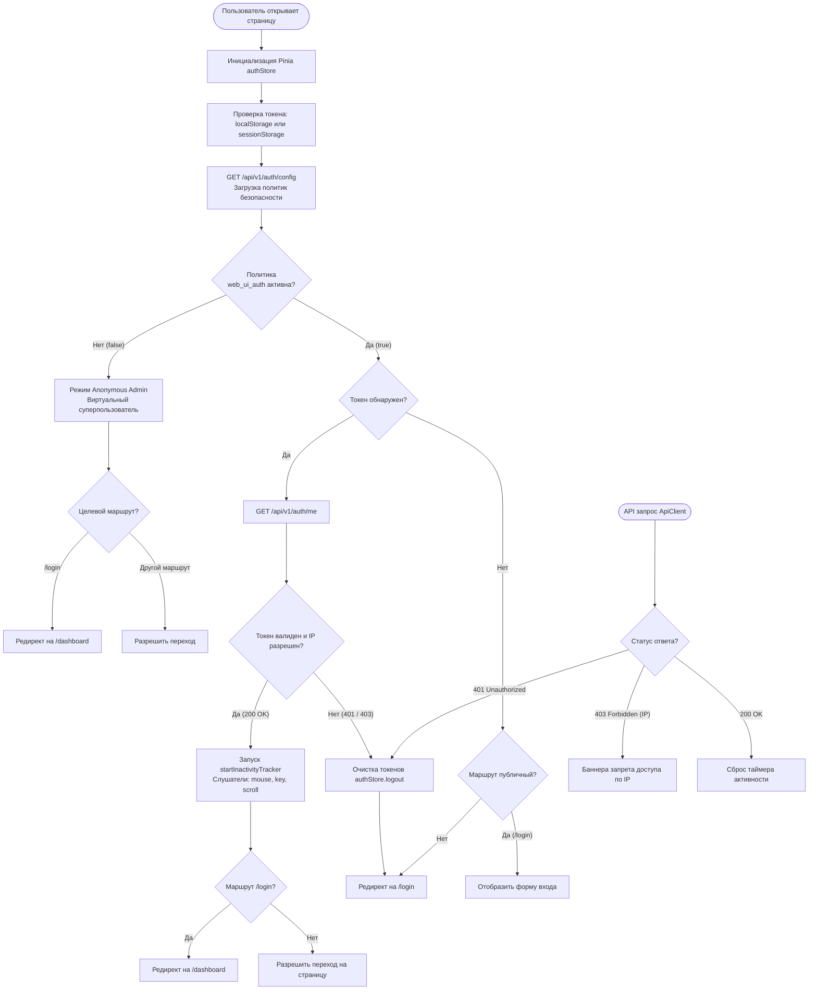

---

## 2. Диаграмма последовательности: Авторизация, «Запомнить меня», Блокировка (Rate Limit) и Восстановление

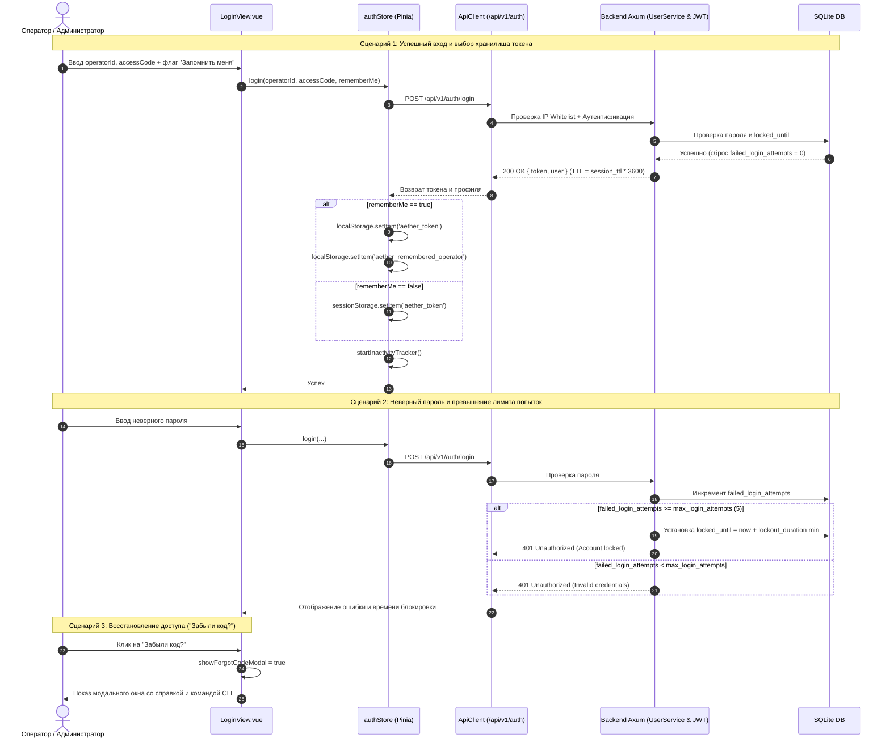

---

## 3. Блок-схема: Контроль неактивности пользователя (Inactivity Timeout)

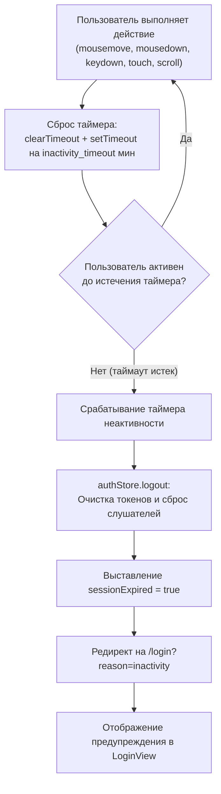

---

## 4. Блок-схема и Sequence-диаграмма: Пошаговый мастер первичной настройки (Onboarding Wizard)

### А. Блок-схема состояний онбординга и авторизации

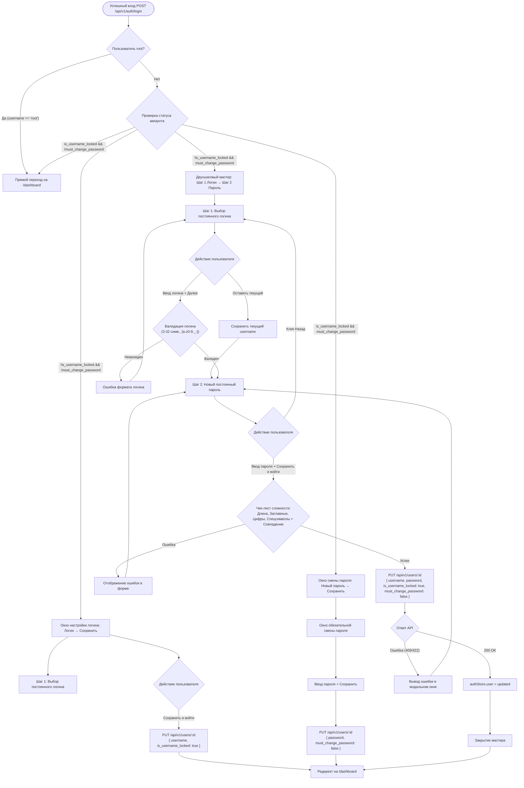

### Б. Sequence-диаграмма взаимодействия UI, Store и Core

```mermaid
sequenceDiagram
    autonumber
    actor User as Пользователь
    participant UI as LoginView.vue (Wizard)
    participant Store as authStore
    participant API as ApiClient (/api/v1/users)
    participant Core as Backend UserService
    Note over User, Core: Вход пользователя (не root) при !is_username_locked || must_change_password
    UI->>UI: Открытие модального окна мастера
    alt Доступна смена логина (!is_username_locked)
        rect rgb(30, 41, 59)
            Note over User, UI: Шаг 1: Персонализация логина
            User->>UI: Ввод нового постоянного логина (или клик "Оставить текущий")
            alt Требуется также смена пароля
                User->>UI: Клик "Далее" (wizardNext)
                UI->>UI: Локальная валидация (длина 3-32, regex a-z0-9._-)
                UI->>UI: Переключение на wizardStep = 'password'
            else Смена пароля отключена
                User->>UI: Клик "Сохранить и войти"
                UI->>API: PUT /api/v1/users/:id { username: "new_login", is_username_locked: true }
            end
        end
    end
    alt Требуется смена пароля (must_change_password)
        rect rgb(30, 41, 59)
            Note over User, UI: Шаг 2: Установка постоянного пароля
            alt Пользователь хочет скорректировать логин (если был Шаг 1)
                User->>UI: Клик "Назад" (wizardBack)
                UI->>UI: Возврат на wizardStep = 'username'
                User->>UI: Корректировка логина и повторный клик "Далее"
            end
            User->>UI: Ввод нового пароля и подтверждения
            loop Динамическая проверка сложности
                UI->>UI: Проверка passwordRequirements
                UI->>User: Интерактивная подсветка чек-листа политики безопасности
            end
        end
    end
    %% Финальное сохранение
    Note over User, Core: Финальное сохранение учетных данных
    User->>UI: Клик "Сохранить и войти"
    UI->>API: PUT /api/v1/users/:id { username?, password?, is_username_locked: true, must_change_password: false }
    API->>Core: update_user (валидация логина + сложность пароля + Argon2id hash)
    alt Ошибка валидации или конфликт логина (409/422)
        Core-->>API: 409 Conflict / 422 Unprocessable Entity
        API-->>UI: Отображение сообщения об ошибке
    else Успешное сохранение
        Core->>Core: UPDATE users SET username = ..., password_hash = ..., is_username_locked = 1, must_change_password = 0
        Core-->>API: 200 OK (UserResponseDto)
        API-->>Store: authStore.user = updated
        API-->>UI: 200 OK
        UI->>UI: Закрытие модального окна
        UI->>UI: router.push('/dashboard')
    end
```

---

## 5. Тест-кейсы для верификации Frontend изменений

### ТК-1: Запоминание оператора и разделение хранилищ токена
* **Given**: Пользователь открывает экран логина `/login`.
* **When**: Пользователь вводит логин `operator1`, отмечает «Запомнить меня» и успешно входит в систему.
* **Then**: Токен записан в `localStorage.getItem('aether_token')`, логин сохранен в `localStorage.getItem('aether_remembered_operator')`. При следующем открытии страницы логин подставляется автоматически.
* **When 2**: Пользователь выходит и входит без галочки «Запомнить меня».
* **Then 2**: Токен записан только в `sessionStorage.getItem('aether_token')`, в `localStorage` токен отсутствует.

### ТК-2: Автоматический выход по таймауту неактивности
* **Given**: Пользователь авторизован, в политиках безопасности установлен `inactivity_timeout = 15`.
* **When**: Пользователь не совершает действий (мышь, клавиатура, скролл) в течение 15 минут.
* **Then**: `authStore` вызывает `logout()`, очищает хранилище и перенаправляет на `/login?reason=inactivity` с выводом сообщения «Сессия завершена из-за длительного отсутствия активности».

### ТК-3: Модальное окно «Забыли код?»
* **Given**: Пользователь находится на странице `/login`.
* **When**: Пользователь нажимает на ссылку «Забыли код?».
* **Then**: Открывается модальное окно `BaseModal` с контактами администратора и готовой CLI-командой для аварийного сброса пароля.

### ТК-4: Пошаговый мастер первичной настройки с разделением логина и пароля
* **Given**: Новый оператор создан с временным логином и флагом `must_change_password: true`.
* **When**: Пользователь входит в систему под временными учетными данными.
* **Then**:
  1. Открывается пошаговый мастер с индикатором (Шаг 1 из 2).
  2. На **Шаге 1** предлагается задать постоянный логин либо нажать «Оставить текущий». Переход происходит по кнопке «Далее» после валидации формата.
  3. На **Шаге 2** отображаются поля ввода нового пароля и подтверждения с интерактивным чеклистом требований сложности. Доступна кнопка «Назад» для возврата к шагу 1.
  4. Нажатие единой финальной кнопки **«Сохранить и войти»** атомарно сохраняет выбранный логин и пароль, сбрасывает флаг смены пароля и выполняет переход на `/dashboard`.

### ТК-5: Вход под системным пользователем root
* **Given**: Система инициализирована с дефолтным суперпользователем `root:root`.
* **When**: Выполняется вход под `root` / `root`.
* **Then**: Мастер первичной настройки не отображается, выполняется мгновенный переход на `/dashboard`. Логин `root` защищен от переименования и удаления.

---

## 6. Блок-схема: Управление политиками безопасности и сессиями в UI

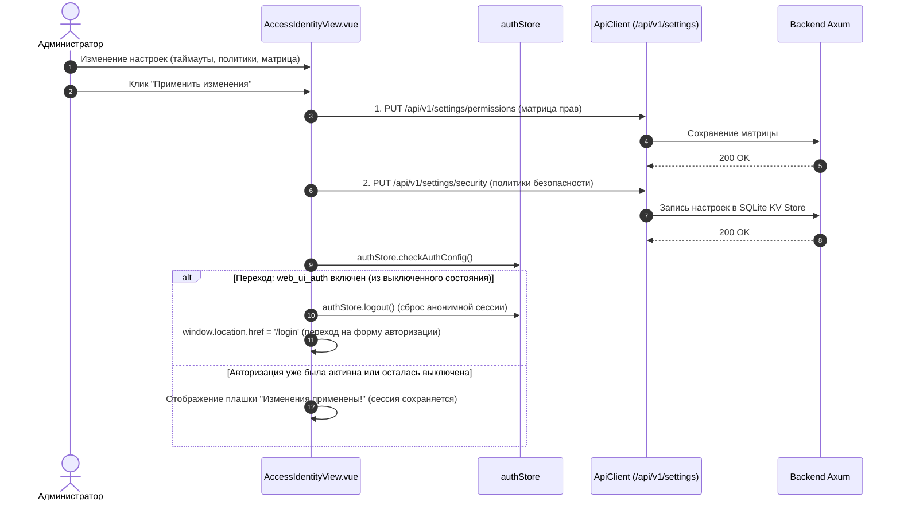

---

## 7. Блок-схема: Иерархия ролей и доступность элементов управления во Frontend

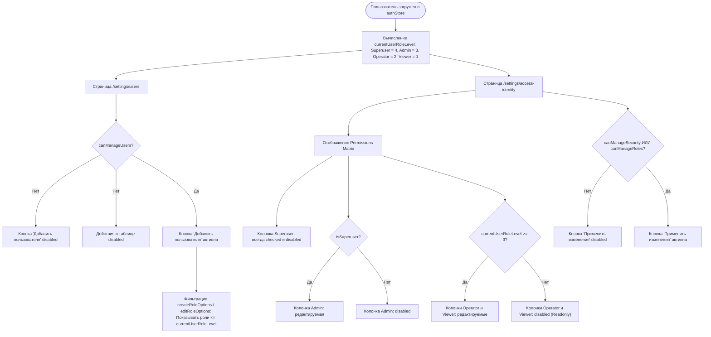

---

## 8. Блок-схема: Персональные настройки оператора, часовой пояс, формат времени и Searchable Select

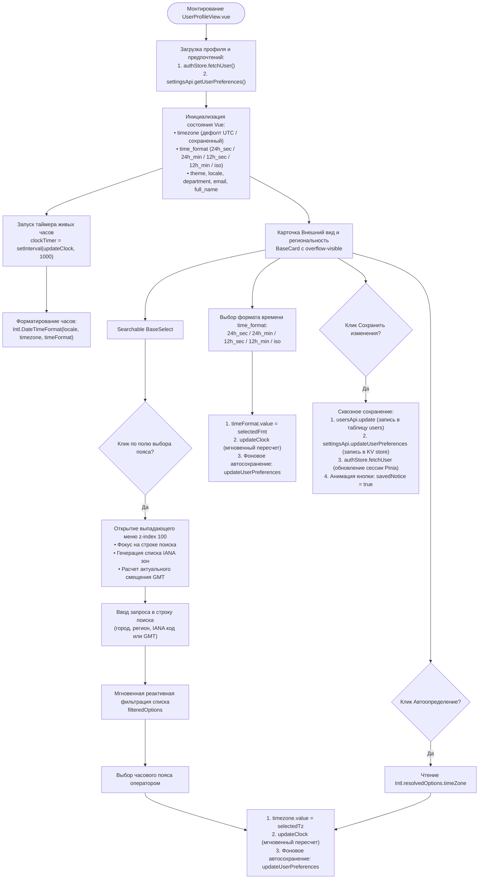

### Диаграмма последовательности: Выбор и синхронизация региональных настроек (Timezone & Time Format)

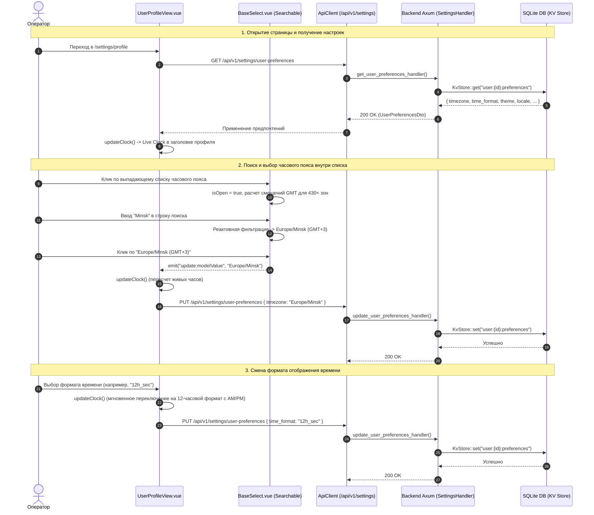

---

## 9. Блок-схема: Жизненный цикл, оптимизация и сквозное отображение аватаров пользователей

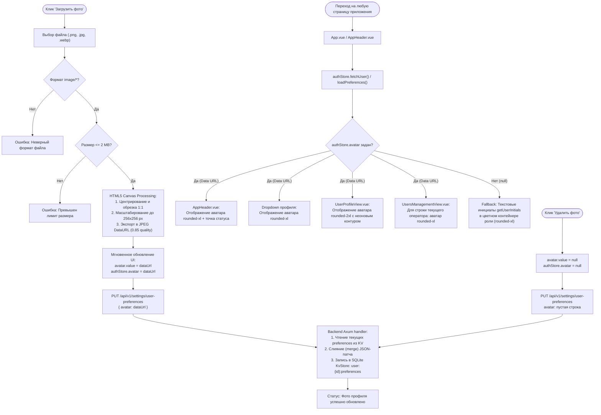

### Диаграмма последовательности: Загрузка аватара и сквозное отображение

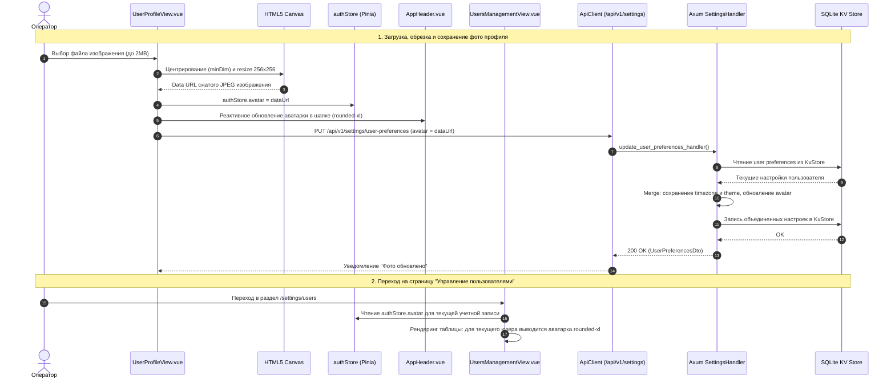

### Тест-кейсы для верификации аватаров
#### ТК-Аватар-1: Загрузка и персистентность аватара
* **Given**: Пользователь авторизован и находится в `/profile`.
* **When**: Пользователь загружает изображение размером до 2MB.
* **Then**: Картинка сжимается до 256x256 px, отображается в карточке профиля, шапке `AppHeader.vue` и сохраняется на бэкенде в KV-хранилище без затирания часового пояса и темы.

#### ТК-Аватар-2: Сохранение аватара при навигации
* **Given**: Аватар успешно загружен и сохранен.
* **When**: Пользователь переходит на страницу `/settings/users` или обновляет страницу.
* **Then**: В верхнем баре (`AppHeader`), выпадающем меню и строке текущего оператора в таблице пользователей отображается миниатюра аватара в стиле `rounded-xl`.

#### ТК-Аватар-3: Сброс аватара к инициалам
* **Given**: Пользователь имеет установленный аватар.
* **When**: Пользователь нажимает «Удалить фото».
* **Then**: Аватар очищается в Pinia store и на сервере, а во всех компонентах плавно возвращается отображение текстовых инициалов в цветных контейнерах ролей.

