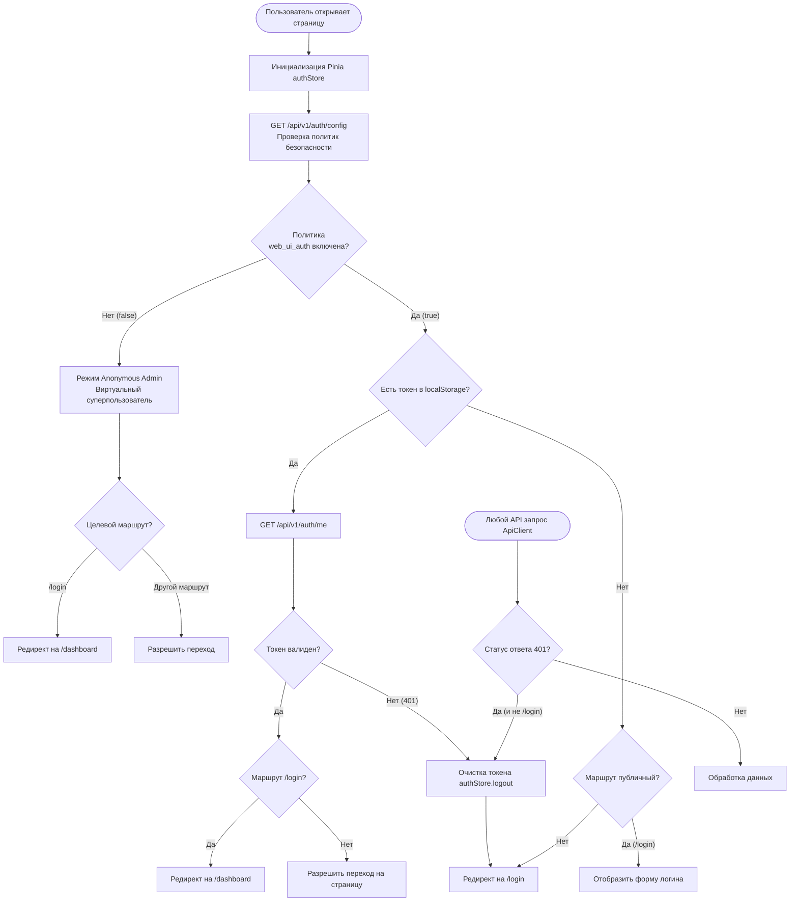
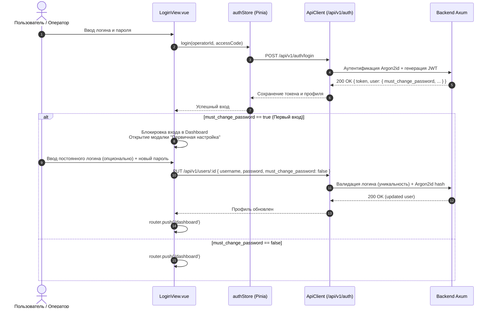
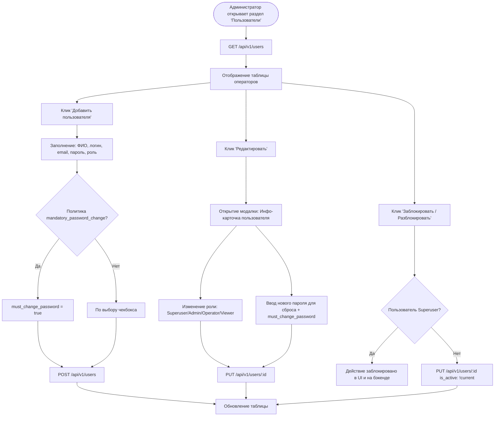
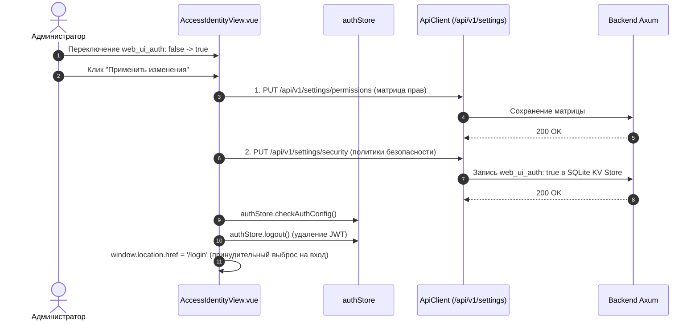

# Архитектура и блок-схемы работы Frontend (Vue 3 + Pinia + Vite)

Данный документ описывает ключевые сценарии функционирования фронтенд-приложения AetherCore NMS Next-Gen: жизненный цикл приложения, навигационные проверки роутера, процедуру первого входа и управления операторами.

---

## 1. Блок-схема: Жизненный цикл и навигация Router Guard

---

## 2. Блок-схема: Процесс входа и первичная настройка (First-Time Setup)

---

## 3. Блок-схема: Управление пользователями администратором

---

## 4. Блок-схема: Управление политиками безопасности и инвалидация сессий

