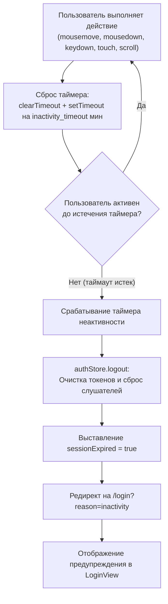
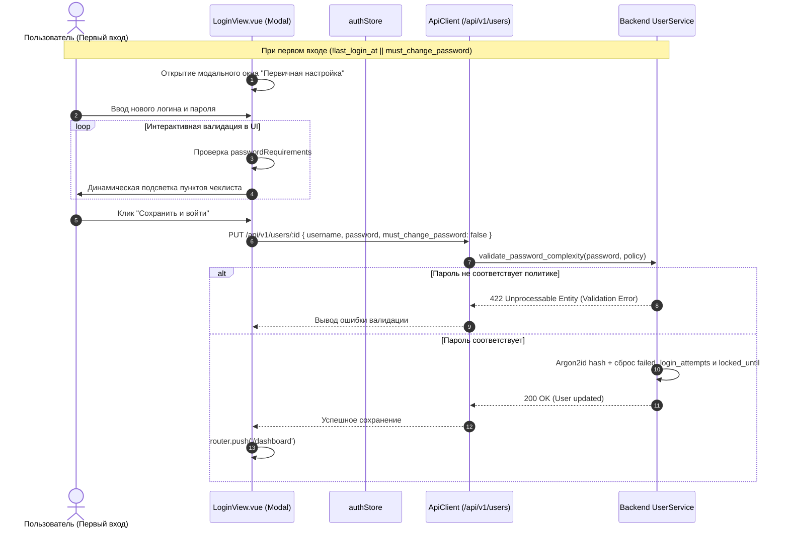
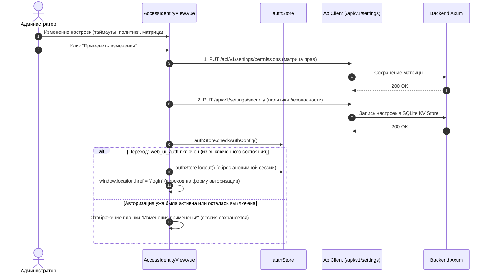

# Архитектура и блок-схемы работы Frontend (Vue 3 + Pinia + Vite)

Данный документ описывает ключевые сценарии функционирования фронтенд-приложения AetherCore NMS Next-Gen: жизненный цикл приложения, навигационные проверки роутера, процедуру входа (включая «Запомнить меня», «Забыли код?», Rate Limiting & Lockout), таймер неактивности, первичную настройку со сложностью паролей и управление операторами.

---

## 1. Блок-схема: Жизненный цикл, проверка токена и Router Guard

```mermaid
graph TD
    Start([Пользователь открывает страницу]) --> InitStore[Инициализация Pinia authStore]
    InitStore --> CheckStorage[Проверка токена: localStorage || sessionStorage]
    CheckStorage --> FetchCfg[GET /api/v1/auth/config<br/>Загрузка политик безопасности]
    FetchCfg --> CheckWebAuth{Политика<br/>web_ui_auth активна?}

    %% Режим без авторизации
    CheckWebAuth -- Нет (false) --> AnonMode[Режим Anonymous Admin<br/>Виртуальный суперпользователь]
    AnonMode --> CheckTargetAnon{Целевой маршрут?}
    CheckTargetAnon -- /login --> RedirDashAnon[Редирект на /dashboard]
    CheckTargetAnon -- Другой маршрут --> AllowAnon[Разрешить переход]

    %% Режим с авторизацией
    CheckWebAuth -- Да (true) --> HasToken{Токен обнаружен?}
    HasToken -- Да --> ValidateMe[GET /api/v1/auth/me]
    ValidateMe --> CheckMeResult{Токен валиден и IP разрешен?}
    CheckMeResult -- Да (200 OK) --> StartTimer[Запуск startInactivityTracker<br/>Слушатели: mouse, key, scroll]
    StartTimer --> CheckTargetAuth{Маршрут /login?}
    CheckTargetAuth -- Да --> RedirDashAuth[Редирект на /dashboard]
    CheckTargetAuth -- Нет --> AllowRoute[Разрешить переход на страницу]
    CheckMeResult -- Нет (401 / 403) --> DropToken[Очистка токенов authStore.logout]
    DropToken --> RedirLogin[Редирект на /login]
    HasToken -- Нет --> IsPublicRoute{Маршрут публичный?}
    IsPublicRoute -- Да (/login) --> ShowLogin[Отобразить форму входа]
    IsPublicRoute -- Нет --> RedirLogin

    %% Глобальный перехват ошибок API
    ApiReq([API запрос ApiClient]) --> OnApiError{Статус ответа?}
    OnApiError -- 401 Unauthorized --> DropToken
    OnApiError -- 403 Forbidden (IP) --> ShowIpError[Баннера запрета доступа по IP]
    OnApiError -- 200 OK --> ResetTimer[Сброс таймера активности]
```

---

## 2. Диаграмма последовательности: Авторизация, «Запомнить меня», Блокировка (Rate Limit) и Восстановление


---

## 3. Блок-схема: Контроль неактивности пользователя (Inactivity Timeout)



---

## 4. Диаграмма: Первичная настройка и проверка сложности паролей (Password Complexity)



---

## 5. Тест-кейсы для верификации Frontend изменений

### ТК-1: Запоминание оператора и разделение хранилищ токена
* **Given**: Пользователь открывает экран логина `/login`.
* **When**: Пользователь вводит логин `operator1`, отмечает «Запомнить меня» и успешно входит в систему.
* **Then**: Токен записан в `localStorage.getItem('nms_token')`, логин сохранен в `localStorage.getItem('nms_remembered_operator')`. При следующем открытии страницы логин подставляется автоматически.
* **When 2**: Пользователь выходит и входит без галочки «Запомнить меня».
* **Then 2**: Токен записан только в `sessionStorage.getItem('nms_token')`, в `localStorage` токен отсутствует.

### ТК-2: Автоматический выход по таймауту неактивности
* **Given**: Пользователь авторизован, в политиках безопасности установлен `inactivity_timeout = 15`.
* **When**: Пользователь не совершает действий (мышь, клавиатура, скролл) в течение 15 минут.
* **Then**: `authStore` вызывает `logout()`, очищает хранилище и перенаправляет на `/login?reason=inactivity` с выводом сообщения «Сессия завершена из-за длительного отсутствия активности».

### ТК-3: Модальное окно «Забыли код?»
* **Given**: Пользователь находится на странице `/login`.
* **When**: Пользователь нажимает на ссылку «Забыли код?».
* **Then**: Открывается модальное окно `BaseModal` с контактами администратора и готовой CLI-командой для аварийного сброса пароля.

### ТК-4: Визуальный чеклист сложности пароля при первом входе
* **Given**: Новый пользователь выполняет первый вход с временным паролем.
* **When**: Появляется модальное окно первичной настройки и пользователь начинает ввод нового пароля.
* **Then**: Под полем ввода динамически подсвечиваются требования (минимальная длина, заглавная буква, цифра, спецсимвол). Кнопка подтверждения блокирует отправку, пока все требования активной политики безопасности не будут удовлетворены.

---

## 6. Блок-схема: Управление политиками безопасности и сессиями в UI



