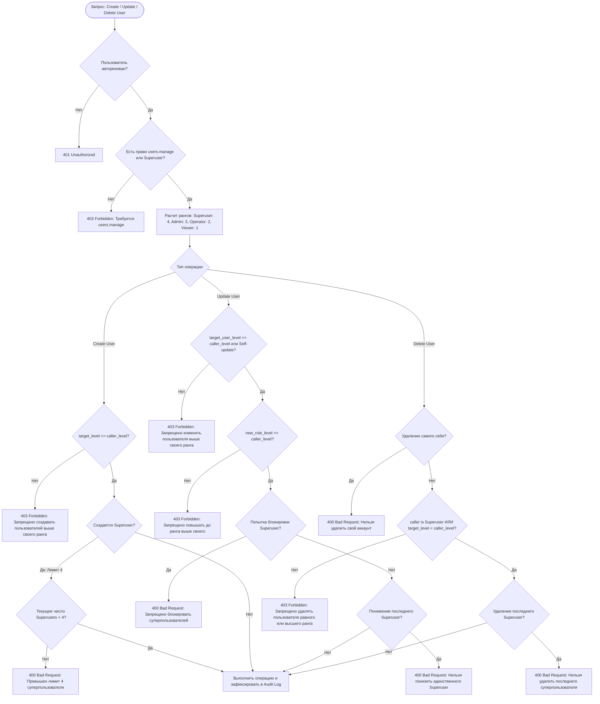
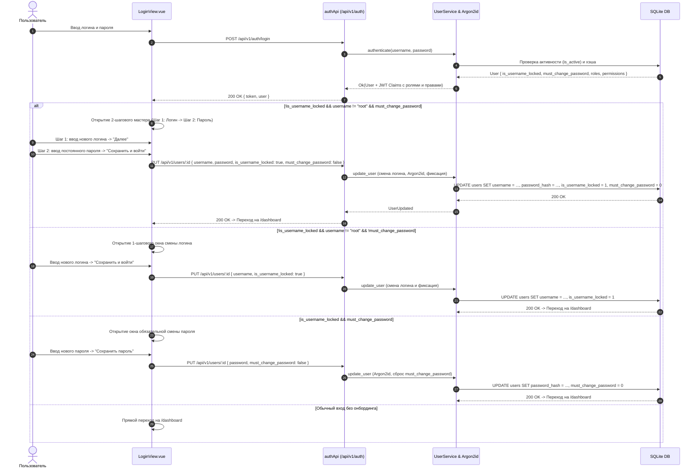
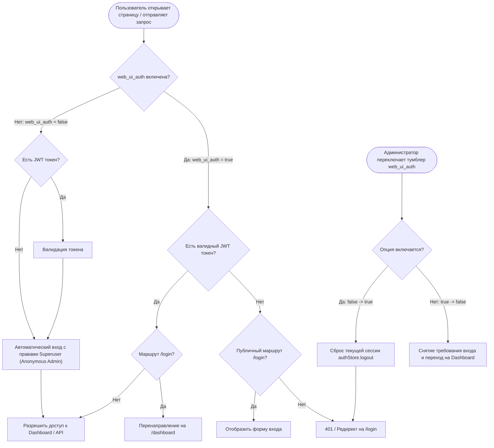
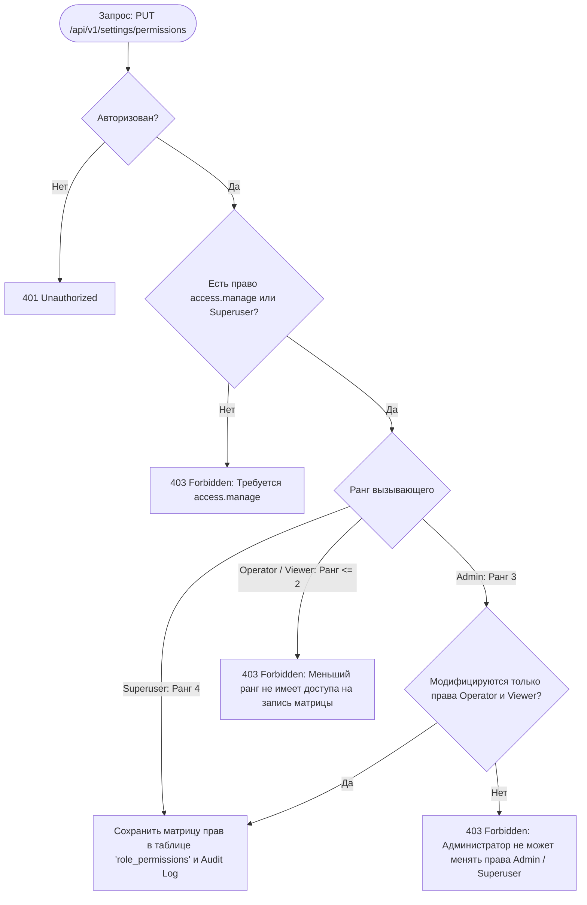

# Архитектура: Политики безопасности, Квоты и Ролевая модель (Security & RBAC)

## 1. Блок-схема и Диаграммы взаимодействия (Mermaid)

### А. Блок-схема иерархии ролей и валидации операций над пользователями (Graph TD)

### Б. Диаграмма последовательности: Авторизация и раздельный онбординг (Sequence Diagram)

### В. Блок-схема политики: Авторизация веб-интерфейса (web_ui_auth)

### Г. Блок-схема разграничения матрицы прав доступа (Permissions Matrix)

---

## 2. Тест-кейсы для верификации (Given-When-Then)

### ТК-1: Запрет создания 5-го суперпользователя
* **Given**: В системе уже зарегистрировано 4 пользователя с ролью `superuser`.
* **When**: Действующий суперпользователь пытается создать 5-го суперпользователя.
* **Then**: Бэкенд возвращает ошибку `400 Bad Request` с сообщением о превышении лимита (максимум 4). В UI опция `Superuser` заблокирована.

### ТК-2: Запрет удаления и понижения единственного суперпользователя
* **Given**: В системе остался ровно 1 активный суперпользователь (`root`).
* **When**: Выполняется запрос на удаление `DELETE /api/v1/users/:id` или попытка сменить его роль на `admin`.
* **Then**: Операция отклоняется с ошибкой `400 Bad Request` ("Нельзя удалить/понизить последнего суперпользователя").

### ТК-3: Запрет блокировки суперпользователей
* **Given**: В таблице операторов выбран пользователь с ролью `superuser`.
* **When**: Выполняется попытка отправить `is_active: false`.
* **Then**: Кнопка блокировки в интерфейсе неактивна (`disabled`), а прямой API-запрос возвращает ошибку `400 Bad Request`.

### ТК-4: Защита от эскалации прав обычным администратором
* **Given**: Авторизован пользователь с ролью `admin` (не `superuser`).
* **When**: Администратор пытается отредактировать пользователя с ролью `superuser` или назначить кому-либо роль `superuser`.
* **Then**: Запрос отклоняется с кодом `403 Forbidden`.

### ТК-5: Раздельная первичная настройка аккаунта и обязательная смена пароля
* **Given**: Администратор создал пользователя с незафиксированным логином (`is_username_locked: false`).
* **When**: Пользователь успешно аутентифицируется с временными учетными данными.
* **Then**: Доступность шагов онбординга определяется строго независимыми флагами:
  1. **Смена логина (`is_username_locked: false`)**: Доступна однократная персонализация логина на Шаге 1. После первого успешного сохранения выставляется `is_username_locked: true`, и дальнейшие попытки сменить логин блокируются на уровне ядра.
  2. **Смена пароля (`must_change_password: true`)**: Требуется обязательная установка постоянного пароля с проверкой сложности.
  3. **Независимость**: Если `must_change_password: false`, пользователь настраивает только логин и сразу входит в систему. Если `must_change_password: true` для старого пользователя (`is_username_locked: true`), окно смены логина не показывается — открывается только форма смены пароля. Для `root` онбординг всегда отключен.

### ТК-6: Переключение политики «Авторизация веб-интерфейса» (web_ui_auth)
* **Given**: Авторизация веб-интерфейса отключена (`web_ui_auth: false`), работа ведется в режиме анонимного суперпользователя.
* **When**: Администратор включает тумблер `web_ui_auth: true` и нажимает «Применить изменения».
* **Then**: Сессия немедленно сбрасывается (`authStore.logout()`), пользователя выкидывает на страницу входа `/login`, а бэкенд начинает строго требовать JWT токен для всех защищенных API-маршрутов.

### ТК-7: Ограничение прав администратора при редактировании пользователей
* **Given**: Администратор открывает модальное окно редактирования пользователя.
* **When**: Отображается форма редактирования.
* **Then**: Администратору доступны исключительно управление ролью (`role`) и процедура сброса пароля (`password`). Поля логина, ФИО и email защищены от редактирования администратором.

### ТК-8: Иерархия ролей и разграничение доступа в матрице RBAC
* **Given**: Авторизован пользователь с ролью меньшего статуса (например, `operator` уровень 2 или `viewer` уровень 1).
* **When**: Пользователь пытается создать/отредактировать учетную запись со статусом выше своего или изменить матрицу прав ролей.
* **Then**:
  1. В интерфейсе создания/редактирования в выпадающих списках отображаются только роли с уровнем $\le$ текущего пользователя.
  2. В таблице кнопка «Добавить пользователя» и действия (редактирование, блокировка, удаление) отключены (`disabled`) при отсутствии права `users.manage`.
  3. В матрице прав (`/settings/access-identity`) колонки высших ролей заблокированы для редактирования, а кнопка «Применить изменения» отключена для пользователей без права `access.manage`.
  4. На уровне API ядро возвращает `403 Forbidden` при любых попытках создания пользователя выше своего ранга (`target_level > caller_level`) или модификации матрицы прав не-администратором/не-суперпользователем.
