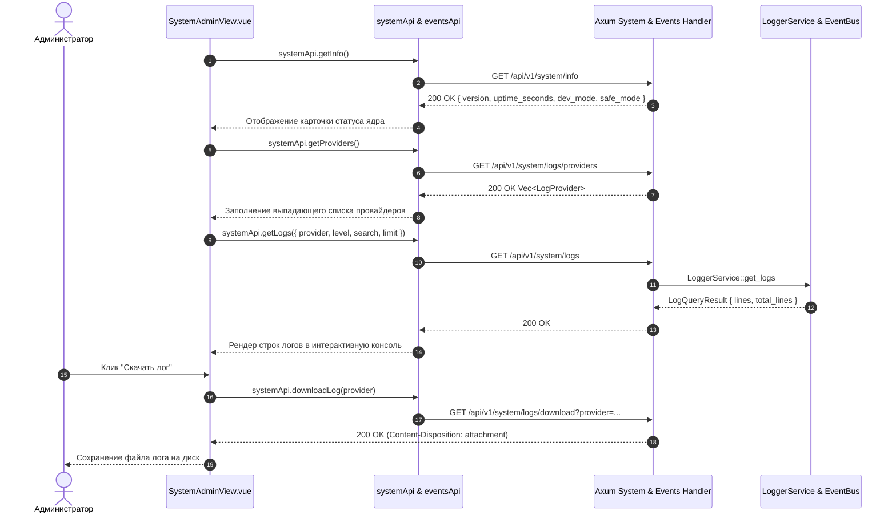

# Архитектура: SystemAdminView.vue & Логирование

## Диаграмма взаимодействия (Mermaid)

## Тест-кейсы для верификации

### ТК-1: Загрузка системной информации и времени непрерывной работы
* **Given**: Страница `/settings/system` открыта.
* **When**: Компонент монтируется.
* **Then**: Вызывается `systemApi.getInfo()`, отображается версия ядра, режим работы и форматированный uptime.

### ТК-2: Интерактивный поиск и фильтрация логов
* **Given**: Выбран уровень логирования `WARN` или `ERROR` и введена поисковая строка.
* **When**: Пользователь применяет фильтр или срабатывает интервал автообновления.
* **Then**: Отправляется `GET /api/v1/system/logs` с параметрами `level` и `search`, консоль обновляется отфильтрованными записями.
