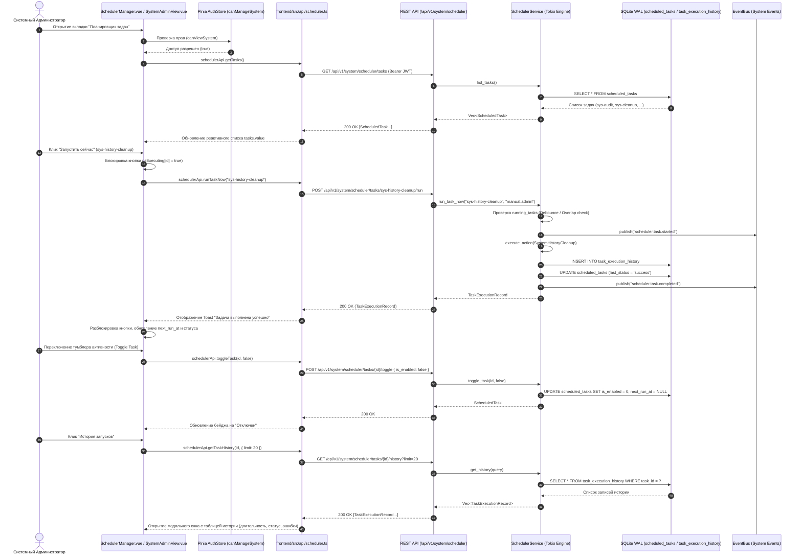

# Архитектура: TaskScheduler.vue (Планировщик задач AetherCore)

## 1. Диаграмма взаимодействия компонентов и потоков данных (Mermaid)

---

## 2. Тест-кейсы для верификации (Given-When-Then)

### ТК-1: Загрузка и отображение системных задач
* **Given**: Пользователь аутентифицирован с ролью `admin` (права `system.view`, `system.manage`).
* **When**: Открывается раздел «Система» -> блок «Планировщик задач».
* **Then**:
  1. Выполняется запрос `GET /api/v1/system/scheduler/tasks`.
  2. В таблице отображаются встроенные задачи: `sys-audit-retention` (ежедневно в 00:00) и `sys-history-cleanup` (ежедневно в 03:00).
  3. Для каждой задачи отображается бейдж статуса (`Idle` / `Running` / `Disabled`), человекочитаемое расписание и дата следующего запуска `next_run_at`.

### ТК-2: Ручной немедленный запуск задачи ("Run Now")
* **Given**: Задача `sys-history-cleanup` находится в состоянии `Idle`, кнопка запуска активна.
* **When**: Администратор нажимает на кнопку «Запустить сейчас».
* **Then**:
  1. Кнопка переходит в состояние `loading`, предотвращая повторные клики.
  2. Отправляется запрос `POST /api/v1/system/scheduler/tasks/sys-history-cleanup/run`.
  3. Бэкенд исполняет действие очистки, пишет результат в `task_execution_history` и возвращает `200 OK`.
  4. Интерфейс показывает Toast-уведомление об успешном завершении, обновляет статус задачи и время `last_run_at`.

### ТК-3: Приостановка и возобновление задачи (Toggle)
* **Given**: Задача включена (`is_enabled = true`).
* **When**: Администратор кликает по переключателю активности задачи в строке таблицы.
* **Then**:
  1. Отправляется запрос `POST /api/v1/system/scheduler/tasks/{id}/toggle` с `{ is_enabled: false }`.
  2. Бэкенд сбрасывает `next_run_at = NULL` и сохраняет состояние в БД.
  3. В таблице бейдж переключается в `Disabled` (серый), время следующего запуска скрывается.

### ТК-4: Создание и удаление пользовательской задачи
* **Given**: Администратор находится в блоке планировщика.
* **When**:
  1. Нажимает кнопку «Добавить задачу».
  2. Заполняет форму: Название «Custom Log Cleanup», Cron «0 4 * * *», действие «Очистка истории».
  3. Нажимает «Сохранить».
* **Then**:
  1. Отправляется `POST /api/v1/system/scheduler/tasks` с телом `CreateTaskDto`.
  2. Задача появляется в списке.
  3. Для созданной пользовательской задачи доступна кнопка «Удалить» (для системных задач кнопка удаления скрыта/заблокирована).

### ТК-5: Просмотр и очистка журнала истории
* **Given**: Для задачи было выполнено несколько запусков (автоматических или ручных).
* **When**: Администратор нажимает кнопку «История» в строке задачи.
* **Then**:
  1. Открывается модальное окно с таблицей запусков (время старта, длительность в миллисекундах, статус `Success` / `Failed`, инициатор `scheduler` или `manual:admin`).
  2. При нажатии «Очистить историю старше 30 дней» отправляется `DELETE /api/v1/system/scheduler/history?days=30`, и таблица истории перезагружается.
