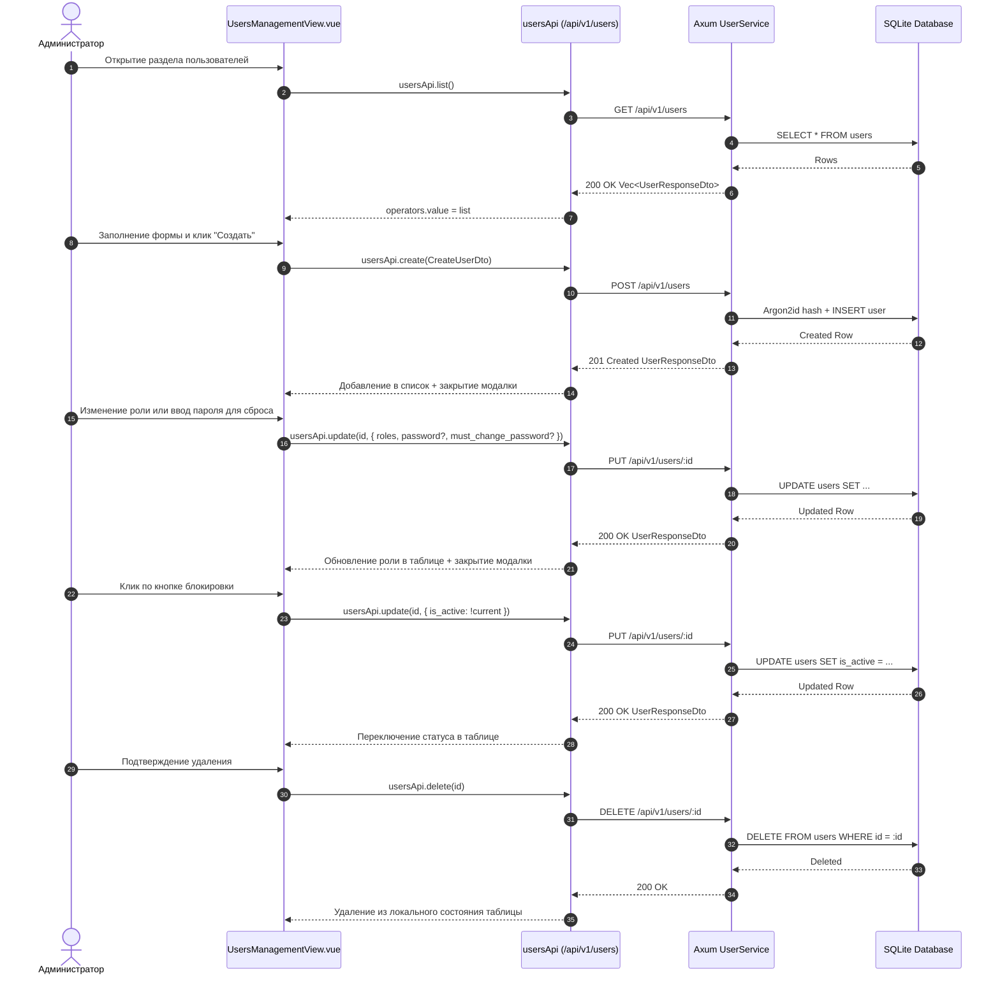

# Архитектура: UsersManagementView.vue

## Диаграмма взаимодействия (Mermaid)

## Тест-кейсы для верификации

### ТК-1: Загрузка списка пользователей
* **Given**: Пользователь авторизован с ролью администратора (`users.view`).
* **When**: Открывается вкладка управления операторами `/settings/users`.
* **Then**: Вызывается `usersApi.list()`, таблица отображает полученных пользователей с бейджами ролей и статуса.

### ТК-2: Создание нового пользователя с валидацией
* **Given**: Открыто модальное окно создания пользователя.
* **When**: Заполнены логин, имя, email, пароль и выбрана роль `operator`, нажата кнопка "Создать".
* **Then**: Отправляется запрос `POST /api/v1/users`. При успехе созданный пользователь немедленно появляется в таблице, модальное окно закрывается.

### ТК-3: Удаление пользователя
* **Given**: В таблице выбран пользователь (не защищенный root/admin).
* **When**: Нажата кнопка удаления и подтверждено действие в модальном окне.
* **Then**: Отправляется `DELETE /api/v1/users/{id}`, пользователь исчезает из таблицы.
