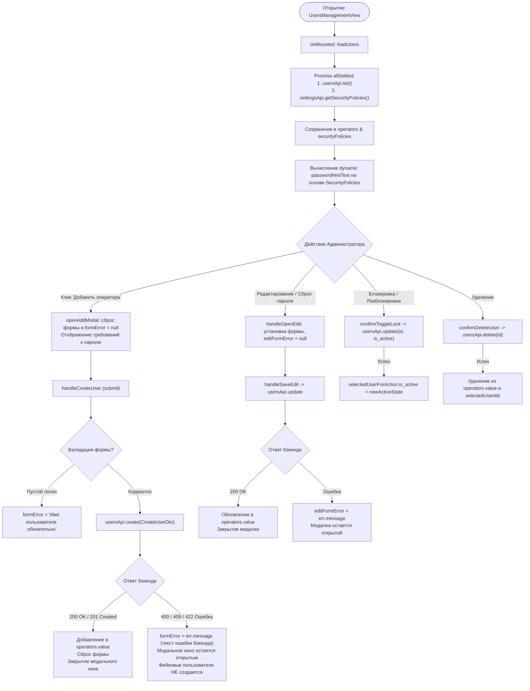
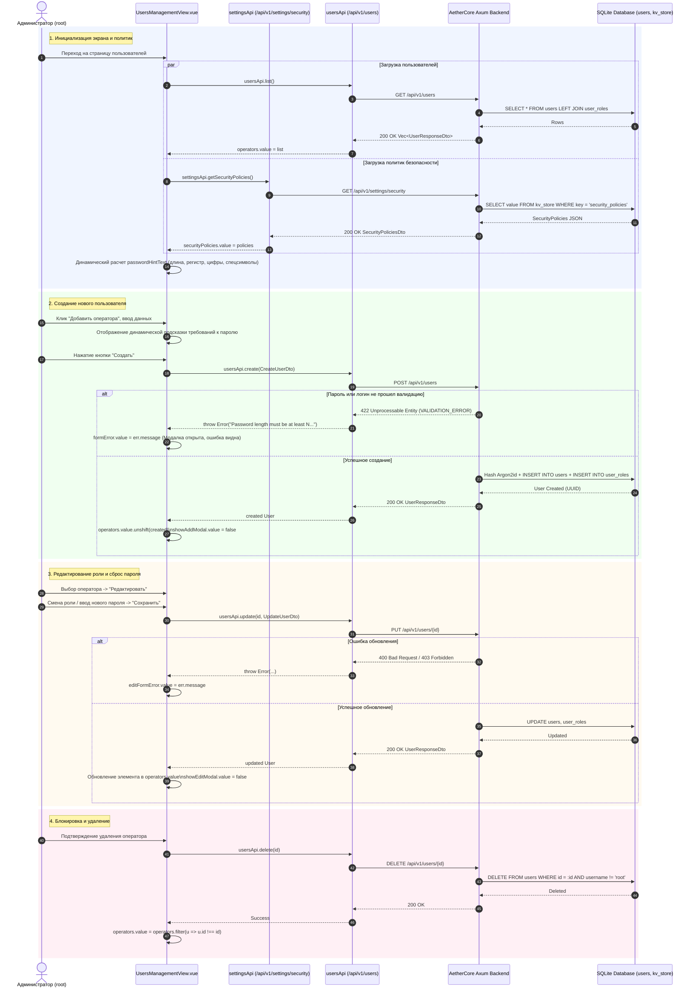

# Архитектура: UsersManagementView.vue

## 1. Обзор архитектуры компонента

Компонент `UsersManagementView.vue` отвечает за полный жизненный цикл управления пользователями (операторами) платформы AetherCore:
* Отображение списка пользователей, их ролей, статусов активности и онлайн-присутствия.
* Динамическое получение системных политик безопасности (`security_policies`) и вычисление требований к паролям.
* Валидация и создание новых пользователей (`POST /api/v1/users`) с обработкой ошибок бэкенда прямо в модальном окне.
* Редактирование ролей и сброс паролей (`PUT /api/v1/users/:id`).
* Блокировка / разблокировка учетных записей (`PUT /api/v1/users/:id`).
* Одиночное и массовое удаление пользователей (`DELETE /api/v1/users/:id`).

---

## 2. Блок-схема и диаграмма последовательности (Mermaid)

### 2.1. Сквозной поток данных компонента

---

### 2.2. Диаграмма последовательности взаимодействия компонентов и API

---

## 3. Тест-кейсы для верификации (Given-When-Then)

### ТК-1: Загрузка пользователей и динамических политик безопасности
* **Given**: Пользователь авторизован как администратор (`root`).
* **When**: Открывается раздел управления пользователями `/settings/users`.
* **Then**: Выполняются параллельные запросы `usersApi.list()` и `settingsApi.getSecurityPolicies()`. Таблица наполняется списком пользователей, а `passwordHintText` рассчитывает текст требований на основе актуальных значений `min_password_length`, `require_uppercase`, `require_digits`, `require_special`.

---

### ТК-2: Попытка создания пользователя с простым паролем (Отображение валидации)
* **Given**: Открыто модальное окно добавления пользователя. В политиках безопасности заданы: `min_password_length: 8`, `require_digits: true`, `require_special: true`.
* **When**: Администратор заполняет `username: "test_op"` и `password: "123"` и нажимает кнопку "Создать".
* **Then**:
  1. Отправляется запрос `POST /api/v1/users`.
  2. Бэкенд возвращает статус `422 Unprocessable Entity` с текстом ошибки валидации.
  3. Модальное окно **не закрывается**.
  4. Внутри модального окна в красном блоке отображается текст ошибки `formError`.
  5. В таблице пользователей **не появляются** временные локальные записи.

---

### ТК-3: Успешное создание пользователя с сохранением в БД
* **Given**: Открыто модальное окно добавления пользователя.
* **When**: Администратор вводит валидный логин (`operator_1`) и пароль, удовлетворяющий политике (`Operator123!`), нажимает "Создать".
* **Then**:
  1. Запрос `POST /api/v1/users` завершается со статусом `200 OK`.
  2. Модальное окно закрывается, форма очищается.
  3. Новый пользователь сразу появляется во главе таблицы.
  4. При переходе на страницу дашборда и возврате обратно на страницу пользователей созданный пользователь **присутствует в списке**.

---

### ТК-4: Редактирование роли и сброс пароля
* **Given**: В таблице выбран существующий оператор.
* **When**: Администратор открывает окно редактирования, меняет роль с `viewer` на `operator`, вводит новый пароль и нажимает "Сохранить".
* **Then**: Вызывается `usersApi.update(id, ...)`. При успехе роль оператора в строке таблицы мгновенно обновляется, модальное окно закрывается. При ошибке валидации модальное окно остается открытым с текстом ошибки.

---

### ТК-5: Защита системного администратора (root)
* **Given**: В списке отображается пользователь `root`.
* **When**: Администратор просматривает действия для пользователя `root`.
* **Then**: Кнопки удаления и блокировки недоступны (скрыты/деактивированы), смена роли суперпользователя заблокирована.

